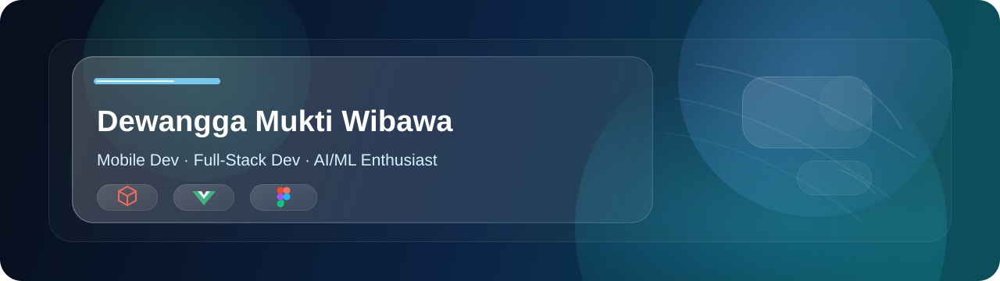
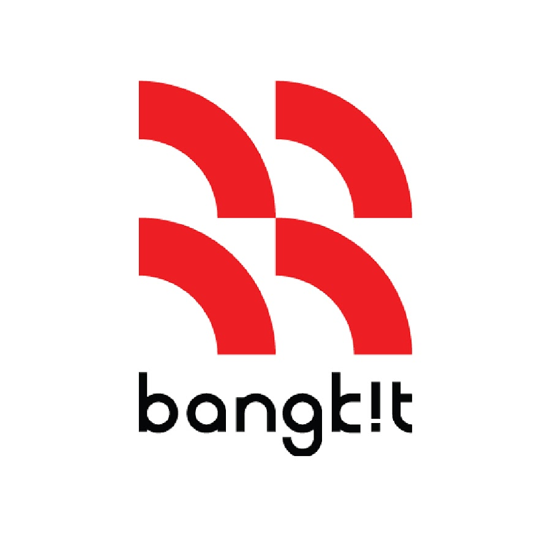

# 

  📱 Mobile Developer | 🌐 Full-Stack Developer | 🤖 AI/ML Enthusiast

  
  
  
  

## Tech Stack

  
  
  
  
  
  
  
  
  
  
  
  
  
  
  
  
  

### AI / Machine Learning

  
  
  

  
   
  <b>Bangkit Academy</b> — Machine Learning Cohort, led by Google, Tokopedia, Gojek & Traveloka

## Currently Building

📱 **Daily Note V2** — an AI-powered personal assistant built with Flutter, using feature-first Clean Architecture, Riverpod, and a hybrid on-device (Gemma / Phi-3-mini) + cloud LLM strategy. It parses free-form Indonesian text into calendar events, expenses, reminders, and notes — all from a single input bar.
*(Not published yet — repo & demo coming soon)*

Also building web platforms (Next.js/TypeScript) and exploring ML deployment for classification and recommendation tasks.

## Featured Projects

| Project | Stack | Link |
|---|---|---|
| **Enjoy Jogja** | Next.js, TypeScript | [Live](https://enjoy-jogja-dewangga.vercel.app/) |
| **Explore Indonesia** | Next.js, TypeScript | [Live](https://explore-indonesia-dewangga.vercel.app/) |
| **Daily Note V2** | Flutter, Riverpod, Gemini API, on-device LLM | GitHub |
| **Volcanic Earthquake Classifier** | Python, ML | GitHub |
| **KAI NoiSense** | IoT / Noise Monitoring | GitHub |

## GitHub Statistics

<table>
  <tr>
    <td width="50%" align="center">
      
    </td>
    <td width="50%" align="center">
      
    </td>
  </tr>
</table>

  <picture>
    <source media="(prefers-color-scheme: dark)" srcset="https://raw.githubusercontent.com/demoon19/demoon19/output/galaga-contribution-graph-dark.svg" />
    <source media="(prefers-color-scheme: light)" srcset="https://raw.githubusercontent.com/demoon19/demoon19/output/galaga-contribution-graph.svg" />
    
  </picture>

<em>Thanks for stopping by! 🚀</em>

